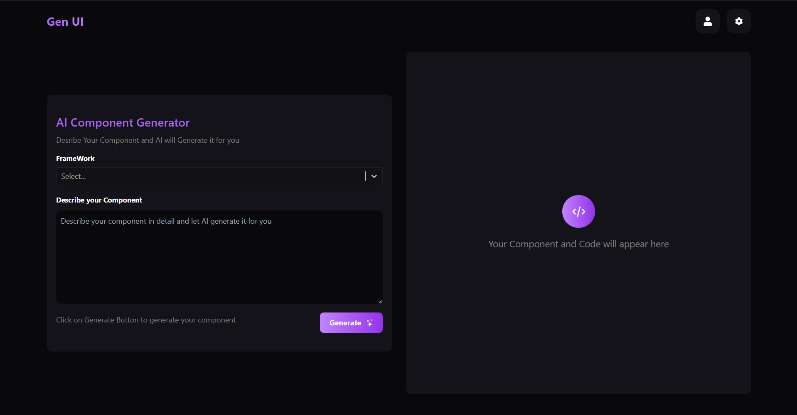

# 🤖 AI Component Generator



A cutting-edge AI-powered web component generator that creates modern, responsive, and animated UI components using Google's Gemini AI. Simply describe your component, choose your framework, and let AI do the magic!

## ✨ Features

- 🎨 Modern, animated UI components
- 🔄 Real-time code preview
- 📱 Responsive design generation
- 🎯 Multiple framework support
- 📝 Clean, well-structured code
- 🚀 Instant code export

## 🛠️ Tech Stack

- **Frontend**: React.js, Tailwind CSS
- **AI Integration**: Google Gemini AI
- **Code Editor**: Monaco Editor
- **State Management**: React Hooks
- **Styling**: Tailwind CSS, Custom CSS
- **UI Components**: React Select, React Icons
- **Build Tool**: Vite
- **Package Manager**: npm

## 🚀 Quick Start

1. **Clone the repository**
```bash
git clone https://github.com/TheCodeWiz/Ai-Component-Generator.git
cd AI-Component-Generator
```

2. **Install dependencies**
```bash
npm install
```

3. **Set up environment variables**
Create a `.env` file in the root directory:
```bash
VITE_GOOGLE_API_KEY=your_gemini_api_key_here
```

4. **Start the development server**
```bash
npm run dev
```

## 🎯 Usage Examples

Here are some example components generated by the AI:

### Modern Food Delivery Login / Sign Up Page
**Prompt**: "create a login and signup page for food delivery website. make sure to make the user fell attractive to the website based on the sleek ui of the login and signup app.
"

**Output**: [View Component](GenUI-Code(2).html)

### Landing page of a Fintech Website
**Prompt**: "create a landing page for the premium fintech website especially in stock market segment . make sure to make the ui so sleek and modern that user gets attracted and addicted to use our website . make sure that the landing page gives a premium fintech vibes to user . make sure there is also an theme toggle feature with all the colour combination working fine.
"

**Output 1**: [View Component](GenUI-Code(3).html)

**Output 2**: [View Component](GenUI-Code(4).html)

## 📚 Supported Frameworks

- HTML + CSS
- HTML + Tailwind CSS
- HTML + Bootstrap
- HTML + CSS + JS


## 🌟 Key Features Explained

1. **AI-Powered Generation**
   - Utilizes Google's Gemini AI for intelligent component generation
   - Context-aware code generation based on framework selection

2. **Real-Time Preview**
   - Live code editor with syntax highlighting
   - Instant component preview
   - Full-screen preview mode

3. **Export Options**
   - Copy code to clipboard
   - Download as HTML file
   - Open in new tab for testing


## 👨‍💻 Author

**Manav Bhatt**
- LinkedIn: [Connect with me](https://www.linkedin.com/in/manav-bhatt1409/)
<!-- - Portfolio: [Visit my portfolio](your-portfolio-url) -->


## 🌟 Show your support

Give a ⭐️ if this project helped you!

---

<p align="center">Made with ❤️ by Manav Bhatt</p>